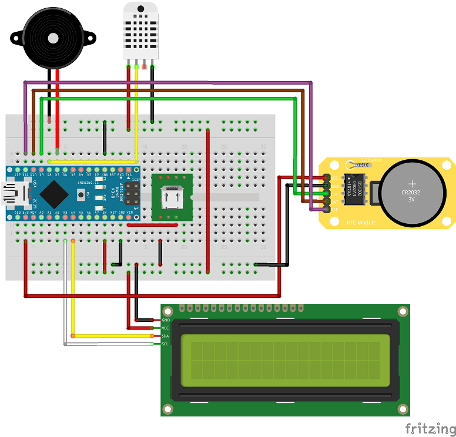
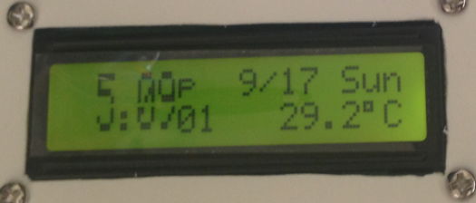
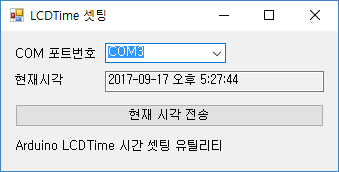

# 1602 LCD와 LCD I2C 모듈을 이용한 시계

## 부품

- 아두이노 나노
- 1602 LCD 모듈
- LCD를 I2C로 통신하게 해주는 모듈
- DS1302 RTC모듈
- 부저
- DHT22 온습도센서
- USB 전원 모듈

## 핀 레이아웃

- LCD I2C 모듈의 SDA는 아두이노의 A4로, SCL은 아두이노의 A5로 연결한다. (Wire 라이브러리 특성임)
- 부저의 +는 D7에 연결한다.
- RTC 모듈의 전원은 3.3v에 유의한다.
- RTC 모듈의 SCLK는 D9, IO는 D10, RST는 D11에 연결한다.
- 외부 USB 전원은 VIN에 연결한다. (주의: 5V 출력 전압이 3.5V 내외로 강하하며 LCD의 콘트라스트에 영향을 준다.)

* 회로도의 1602 LCD 모듈과 DS1302 RTC 모듈은 인터넷에서 받아옴

## 동작모습

시간과 분을 2줄에 걸쳐서 12시간제로 표시한다.

상단 줄에는 am/pm 표시와 월/일, 요일을 표시한다.

하단 줄에는 초와 현재 온도, 습도를 번갈아가며 표시한다.

## 시간셋업

DS1302 RTC 모듈은 시간이 잘 안맞는 경향이 있어 자주 보정이 필요하다.

시간은 아두이노의 USB포트 시리얼 인터페이스를 통해서 셋팅할 수 있다.

시간을 설정하려면 "T연월일시분초." (끝에 .이 포함된다.)을 전송한다.

Windows에서 시리얼 인터페이스를 통해 직접 세팅하기는 번거로우니 LCDTimeSet 프로그램을 통해 설정한다.

